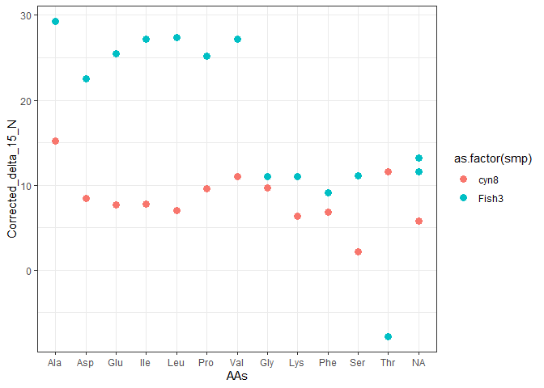

<!-- README.md is generated from README.Rmd. Please edit that file -->

# CSIAIndxs

<!-- badges: start -->
<!-- badges: end -->

The goal of CSIAIndxs is to …

## Installation

You can install the released version of CSIAIndxs from
[CRAN](https://CRAN.R-project.org) with:

``` r
install.packages("CSIAIndxs")
```

## Example

This is a basic example which shows you how to solve a common problem:

``` r
library(CSIAIndxs)
data("DATASET")

df <- label_TS_Nitrogen(df = DATASET)
#> Warning: Removed 3 rows containing missing values (geom_point).

#> Warning: Removed 3 rows containing missing values (geom_point).
```



You’ll still need to render `README.Rmd` regularly, to keep `README.md`
up-to-date. `devtools::build_readme()` is handy for this. You could also
use GitHub Actions to re-render `README.Rmd` every time you push. An
example workflow can be found here:
<https://github.com/r-lib/actions/tree/master/examples>.

In that case, don’t forget to commit and push the resulting figure
files, so they display on GitHub and CRAN.
