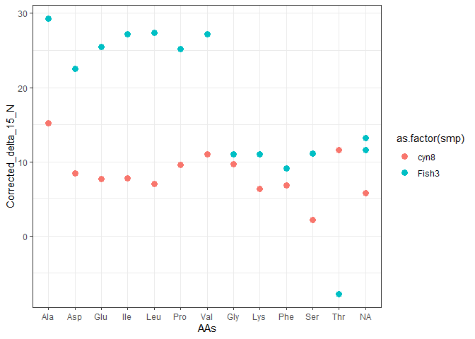
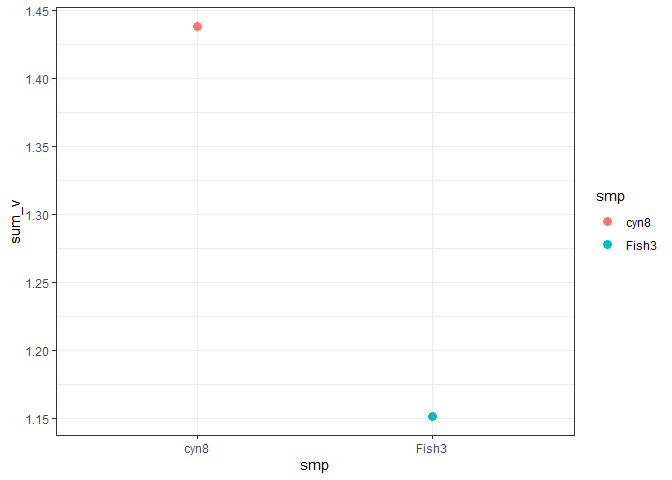
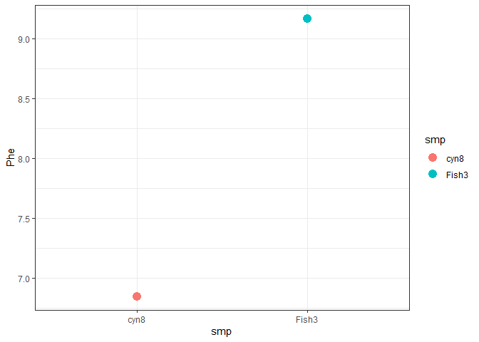

<!-- README.md is generated from README.Rmd. Please edit that file -->

# CSIAIndxs

<!-- badges: start -->
<!-- badges: end -->

The goal of CSIAIndxs is to …

## Installation

You can install the released version of CSIAIndxs from
[CRAN](https://CRAN.R-project.org) with:

``` r
install.packages("CSIAIndxs")
```

## Example

This is a basic example which shows you how to solve a common problem:

``` r
library(CSIAIndxs)
data("DATASET")

df <- label_TS_Nitrogen(df = DATASET)
#> Warning: Removed 3 rows containing missing values (geom_point).

#> Warning: Removed 3 rows containing missing values (geom_point).
```



``` r
df <- calc_TP(df = df)
#> Loading required package: propagate
#> Loading required package: MASS
#> Loading required package: tmvtnorm
#> Warning: package 'tmvtnorm' was built under R version 4.1.1
#> Loading required package: mvtnorm
#> Loading required package: Matrix
#> Loading required package: stats4
#> Loading required package: gmm
#> Warning: package 'gmm' was built under R version 4.1.1
#> Loading required package: sandwich
#> Warning: package 'sandwich' was built under R version 4.1.1
#> Loading required package: Rcpp
#> Loading required package: ff
#> Warning: package 'ff' was built under R version 4.1.1
#> Loading required package: bit
#> 
#> Attaching package: 'bit'
#> The following object is masked from 'package:base':
#> 
#>     xor
#> Attaching package ff
#> - getOption("fftempdir")=="C:/Users/catri/AppData/Local/Temp/RtmpodW5Qo/ff"
#> - getOption("ffextension")=="ff"
#> - getOption("ffdrop")==TRUE
#> - getOption("fffinonexit")==TRUE
#> - getOption("ffpagesize")==65536
#> - getOption("ffcaching")=="mmnoflush"  -- consider "ffeachflush" if your system stalls on large writes
#> - getOption("ffbatchbytes")==165056348.16 -- consider a different value for tuning your system
#> - getOption("ffmaxbytes")==8252817408 -- consider a different value for tuning your system
#> 
#> Attaching package: 'ff'
#> The following objects are masked from 'package:utils':
#> 
#>     write.csv, write.csv2
#> The following objects are masked from 'package:base':
#> 
#>     is.factor, is.ordered
#> Loading required package: minpack.lm
#> Warning: package 'minpack.lm' was built under R version 4.1.1
#> Loading required package: dplyr
#> 
#> Attaching package: 'dplyr'
#> The following object is masked from 'package:MASS':
#> 
#>     select
#> The following objects are masked from 'package:stats':
#> 
#>     filter, lag
#> The following objects are masked from 'package:base':
#> 
#>     intersect, setdiff, setequal, union
```

``` r
df <- calc_sum_v(df = df)
```



``` r
df <- pull_AA(df = df, AA_nm = "Phe")

library(ggplot2)
ggplot() +
  geom_point(data = df, aes(x = smp, y = Phe, color = smp), size = 4) +
  theme_bw()
```



You’ll still need to render `README.Rmd` regularly, to keep `README.md`
up-to-date. `devtools::build_readme()` is handy for this. You could also
use GitHub Actions to re-render `README.Rmd` every time you push. An
example workflow can be found here:
<https://github.com/r-lib/actions/tree/master/examples>.

In that case, don’t forget to commit and push the resulting figure
files, so they display on GitHub and CRAN.
