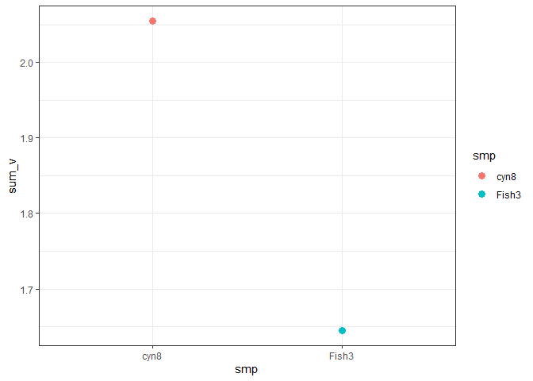

<!-- README.md is generated from README.Rmd. Please edit that file -->

# CSIAIndxs

<!-- badges: start -->
<!-- badges: end -->

The goal of CSIAIndxs is to …

## Installation

You can install the released version of CSIAIndxs from
[CRAN](https://CRAN.R-project.org) with:

``` r
install.packages("CSIAIndxs")
```

## Example

This is a basic example which shows you how to solve a common problem:

``` r
library(CSIAIndxs)
data("DATASET")

df <- label_TS_Nitrogen(df = DATASET)
#> Warning: Removed 3 rows containing missing values (geom_point).
#> Removed 3 rows containing missing values (geom_point).
```


``` r
df <- calc_TP(df = df)
#> Loading required package: propagate
#> Loading required package: MASS
#> Loading required package: tmvtnorm
#> Warning: package 'tmvtnorm' was built under R version 4.1.1
#> Loading required package: mvtnorm
#> Loading required package: Matrix
#> Loading required package: stats4
#> Loading required package: gmm
#> Warning: package 'gmm' was built under R version 4.1.1
#> Loading required package: sandwich
#> Warning: package 'sandwich' was built under R version 4.1.1
#> Loading required package: Rcpp
#> Loading required package: ff
#> Warning: package 'ff' was built under R version 4.1.1
#> Loading required package: bit
#> 
#> Attaching package: 'bit'
#> The following object is masked from 'package:base':
#> 
#>     xor
#> Attaching package ff
#> - getOption("fftempdir")=="C:/Users/catri/AppData/Local/Temp/Rtmpmkf8t5/ff"
#> - getOption("ffextension")=="ff"
#> - getOption("ffdrop")==TRUE
#> - getOption("fffinonexit")==TRUE
#> - getOption("ffpagesize")==65536
#> - getOption("ffcaching")=="mmnoflush"  -- consider "ffeachflush" if your system stalls on large writes
#> - getOption("ffbatchbytes")==165056348.16 -- consider a different value for tuning your system
#> - getOption("ffmaxbytes")==8252817408 -- consider a different value for tuning your system
#> 
#> Attaching package: 'ff'
#> The following objects are masked from 'package:utils':
#> 
#>     write.csv, write.csv2
#> The following objects are masked from 'package:base':
#> 
#>     is.factor, is.ordered
#> Loading required package: minpack.lm
#> Warning: package 'minpack.lm' was built under R version 4.1.1
#> Loading required package: dplyr
#> 
#> Attaching package: 'dplyr'
#> The following object is masked from 'package:MASS':
#> 
#>     select
#> The following objects are masked from 'package:stats':
#> 
#>     filter, lag
#> The following objects are masked from 'package:base':
#> 
#>     intersect, setdiff, setequal, union
```

``` r
df <- calc_sum_v(df = df)
```



``` r
df <- pull_AA(df = df, AA_nm = "Phe")

library(ggplot2)
ggplot() +
  geom_point(data = df, aes(x = smp, y = Phe, color = smp), size = 4) +
  theme_bw()
```


``` r
df <- calc_source_mean(id_col = "smp", 
                       corrected_data_col = "Corrected_delta_15_N" ,
                       std_col = "Stdev",
                       data = df)


df
#>      smp AAs n        Mean       Stdev Corrected_delta_15_N T_S        TP
#> 1   cyn8 Ala 2  14.4970753 0.442942292            15.205986   T 0.6817864
#> 2   cyn8 Gly 2   6.9877411 0.175190286             9.683061   S 0.6817864
#> 3   cyn8 Thr 2   8.3256383 0.164498071            11.575362   S 0.6817864
#> 4   cyn8 Ser 2   0.1066166 0.319262162             2.147815   S 0.6817864
#> 5   cyn8 Val 2  10.5873516 0.361803930            11.011368   T 0.6817864
#> 6   cyn8 Leu 2   5.6506520 0.019066197             6.990876   T 0.6817864
#> 7   cyn8 Ile 2   6.6092237 0.419361783             7.783105   T 0.6817864
#> 8   cyn8 Pro 2   8.9881033 0.192489356             9.612556   T 0.6817864
#> 9   cyn8 Asp 2   7.8145245 0.076841703             8.488950   T 0.6817864
#> 10  cyn8 Glu 2   6.8098402 0.109132511             7.731808   T 0.6817864
#> 11  cyn8 Phe 2   6.0502487 0.489433213             6.850231   S 0.6817864
#> 12  cyn8 Lys 2   5.4584253 0.370696856             6.373664   S 0.6817864
#> 13 Fish3 Ala 2  28.5452712 0.092465742            29.254182   T 2.7096897
#> 14 Fish3 Gly 2   8.2977440 0.265843623            10.993064   S 2.7096897
#> 15 Fish3 Thr 2 -11.0083223 0.209576380            -7.758599   S 2.7096897
#> 16 Fish3 Ser 2   9.0638214 0.009529587            11.105020   S 2.7096897
#> 17 Fish3 Val 2  26.7303706 0.192603857            27.154387   T 2.7096897
#> 18 Fish3 Leu 2  26.0738342 0.144830702            27.414059   T 2.7096897
#> 19 Fish3 Ile 2  25.9780957 0.446699982            27.151977   T 2.7096897
#> 20 Fish3 Pro 2  24.5228979 0.191398870            25.147351   T 2.7096897
#> 21 Fish3 Asp 2  21.8749559 0.002468819            22.549382   T 2.7096897
#> 22 Fish3 Glu 2  24.5341456 0.350326156            25.456113   T 2.7096897
#> 23 Fish3 Phe 2   8.3624889 0.131278232             9.162472   S 2.7096897
#> 24 Fish3 Lys 2  10.1042539 0.111296339            11.019493   S 2.7096897
#>        TP_SD TP_low2.5 TP_low97.5      Ala     Ala_SD      Val    Val_SD
#> 1  0.2527523 0.1864005   1.177172 15.20599 0.44294229 11.01137 0.3618039
#> 2  0.2527523 0.1864005   1.177172 15.20599 0.44294229 11.01137 0.3618039
#> 3  0.2527523 0.1864005   1.177172 15.20599 0.44294229 11.01137 0.3618039
#> 4  0.2527523 0.1864005   1.177172 15.20599 0.44294229 11.01137 0.3618039
#> 5  0.2527523 0.1864005   1.177172 15.20599 0.44294229 11.01137 0.3618039
#> 6  0.2527523 0.1864005   1.177172 15.20599 0.44294229 11.01137 0.3618039
#> 7  0.2527523 0.1864005   1.177172 15.20599 0.44294229 11.01137 0.3618039
#> 8  0.2527523 0.1864005   1.177172 15.20599 0.44294229 11.01137 0.3618039
#> 9  0.2527523 0.1864005   1.177172 15.20599 0.44294229 11.01137 0.3618039
#> 10 0.2527523 0.1864005   1.177172 15.20599 0.44294229 11.01137 0.3618039
#> 11 0.2527523 0.1864005   1.177172 15.20599 0.44294229 11.01137 0.3618039
#> 12 0.2527523 0.1864005   1.177172 15.20599 0.44294229 11.01137 0.3618039
#> 13 0.3971226 1.9313432   3.488036 29.25418 0.09246574 27.15439 0.1926039
#> 14 0.3971226 1.9313432   3.488036 29.25418 0.09246574 27.15439 0.1926039
#> 15 0.3971226 1.9313432   3.488036 29.25418 0.09246574 27.15439 0.1926039
#> 16 0.3971226 1.9313432   3.488036 29.25418 0.09246574 27.15439 0.1926039
#> 17 0.3971226 1.9313432   3.488036 29.25418 0.09246574 27.15439 0.1926039
#> 18 0.3971226 1.9313432   3.488036 29.25418 0.09246574 27.15439 0.1926039
#> 19 0.3971226 1.9313432   3.488036 29.25418 0.09246574 27.15439 0.1926039
#> 20 0.3971226 1.9313432   3.488036 29.25418 0.09246574 27.15439 0.1926039
#> 21 0.3971226 1.9313432   3.488036 29.25418 0.09246574 27.15439 0.1926039
#> 22 0.3971226 1.9313432   3.488036 29.25418 0.09246574 27.15439 0.1926039
#> 23 0.3971226 1.9313432   3.488036 29.25418 0.09246574 27.15439 0.1926039
#> 24 0.3971226 1.9313432   3.488036 29.25418 0.09246574 27.15439 0.1926039
#>          Leu    Leu_SD       Ile    Ile_SD       Pro    Pro_SD      Asp
#> 1   6.990876 0.0190662  7.783105 0.4193618  9.612556 0.1924894  8.48895
#> 2   6.990876 0.0190662  7.783105 0.4193618  9.612556 0.1924894  8.48895
#> 3   6.990876 0.0190662  7.783105 0.4193618  9.612556 0.1924894  8.48895
#> 4   6.990876 0.0190662  7.783105 0.4193618  9.612556 0.1924894  8.48895
#> 5   6.990876 0.0190662  7.783105 0.4193618  9.612556 0.1924894  8.48895
#> 6   6.990876 0.0190662  7.783105 0.4193618  9.612556 0.1924894  8.48895
#> 7   6.990876 0.0190662  7.783105 0.4193618  9.612556 0.1924894  8.48895
#> 8   6.990876 0.0190662  7.783105 0.4193618  9.612556 0.1924894  8.48895
#> 9   6.990876 0.0190662  7.783105 0.4193618  9.612556 0.1924894  8.48895
#> 10  6.990876 0.0190662  7.783105 0.4193618  9.612556 0.1924894  8.48895
#> 11  6.990876 0.0190662  7.783105 0.4193618  9.612556 0.1924894  8.48895
#> 12  6.990876 0.0190662  7.783105 0.4193618  9.612556 0.1924894  8.48895
#> 13 27.414059 0.1448307 27.151977 0.4467000 25.147351 0.1913989 22.54938
#> 14 27.414059 0.1448307 27.151977 0.4467000 25.147351 0.1913989 22.54938
#> 15 27.414059 0.1448307 27.151977 0.4467000 25.147351 0.1913989 22.54938
#> 16 27.414059 0.1448307 27.151977 0.4467000 25.147351 0.1913989 22.54938
#> 17 27.414059 0.1448307 27.151977 0.4467000 25.147351 0.1913989 22.54938
#> 18 27.414059 0.1448307 27.151977 0.4467000 25.147351 0.1913989 22.54938
#> 19 27.414059 0.1448307 27.151977 0.4467000 25.147351 0.1913989 22.54938
#> 20 27.414059 0.1448307 27.151977 0.4467000 25.147351 0.1913989 22.54938
#> 21 27.414059 0.1448307 27.151977 0.4467000 25.147351 0.1913989 22.54938
#> 22 27.414059 0.1448307 27.151977 0.4467000 25.147351 0.1913989 22.54938
#> 23 27.414059 0.1448307 27.151977 0.4467000 25.147351 0.1913989 22.54938
#> 24 27.414059 0.1448307 27.151977 0.4467000 25.147351 0.1913989 22.54938
#>         Asp_SD       Glu    Glu_SD    sum_v  sum_v_SD sum_v_low2.5
#> 1  0.076841703  7.731808 0.1091325 2.054507 0.4188640     1.233548
#> 2  0.076841703  7.731808 0.1091325 2.054507 0.4188640     1.233548
#> 3  0.076841703  7.731808 0.1091325 2.054507 0.4188640     1.233548
#> 4  0.076841703  7.731808 0.1091325 2.054507 0.4188640     1.233548
#> 5  0.076841703  7.731808 0.1091325 2.054507 0.4188640     1.233548
#> 6  0.076841703  7.731808 0.1091325 2.054507 0.4188640     1.233548
#> 7  0.076841703  7.731808 0.1091325 2.054507 0.4188640     1.233548
#> 8  0.076841703  7.731808 0.1091325 2.054507 0.4188640     1.233548
#> 9  0.076841703  7.731808 0.1091325 2.054507 0.4188640     1.233548
#> 10 0.076841703  7.731808 0.1091325 2.054507 0.4188640     1.233548
#> 11 0.076841703  7.731808 0.1091325 2.054507 0.4188640     1.233548
#> 12 0.076841703  7.731808 0.1091325 2.054507 0.4188640     1.233548
#> 13 0.002468819 25.456113 0.3503262 1.645405 0.3198911     1.018430
#> 14 0.002468819 25.456113 0.3503262 1.645405 0.3198911     1.018430
#> 15 0.002468819 25.456113 0.3503262 1.645405 0.3198911     1.018430
#> 16 0.002468819 25.456113 0.3503262 1.645405 0.3198911     1.018430
#> 17 0.002468819 25.456113 0.3503262 1.645405 0.3198911     1.018430
#> 18 0.002468819 25.456113 0.3503262 1.645405 0.3198911     1.018430
#> 19 0.002468819 25.456113 0.3503262 1.645405 0.3198911     1.018430
#> 20 0.002468819 25.456113 0.3503262 1.645405 0.3198911     1.018430
#> 21 0.002468819 25.456113 0.3503262 1.645405 0.3198911     1.018430
#> 22 0.002468819 25.456113 0.3503262 1.645405 0.3198911     1.018430
#> 23 0.002468819 25.456113 0.3503262 1.645405 0.3198911     1.018430
#> 24 0.002468819 25.456113 0.3503262 1.645405 0.3198911     1.018430
#>    sum_v_low97.5      Phe    Phe_SD   S_mean S_mean_sd
#> 1       2.875466 6.850231 0.4894332 7.326027 0.3662788
#> 2       2.875466 6.850231 0.4894332 7.326027 0.3662788
#> 3       2.875466 6.850231 0.4894332 7.326027 0.3662788
#> 4       2.875466 6.850231 0.4894332 7.326027 0.3662788
#> 5       2.875466 6.850231 0.4894332 7.326027 0.3662788
#> 6       2.875466 6.850231 0.4894332 7.326027 0.3662788
#> 7       2.875466 6.850231 0.4894332 7.326027 0.3662788
#> 8       2.875466 6.850231 0.4894332 7.326027 0.3662788
#> 9       2.875466 6.850231 0.4894332 7.326027 0.3662788
#> 10      2.875466 6.850231 0.4894332 7.326027 0.3662788
#> 11      2.875466 6.850231 0.4894332 7.326027 0.3662788
#> 12      2.875466 6.850231 0.4894332 7.326027 0.3662788
#> 13      2.272381 9.162472 0.1312782 6.904290 0.1899386
#> 14      2.272381 9.162472 0.1312782 6.904290 0.1899386
#> 15      2.272381 9.162472 0.1312782 6.904290 0.1899386
#> 16      2.272381 9.162472 0.1312782 6.904290 0.1899386
#> 17      2.272381 9.162472 0.1312782 6.904290 0.1899386
#> 18      2.272381 9.162472 0.1312782 6.904290 0.1899386
#> 19      2.272381 9.162472 0.1312782 6.904290 0.1899386
#> 20      2.272381 9.162472 0.1312782 6.904290 0.1899386
#> 21      2.272381 9.162472 0.1312782 6.904290 0.1899386
#> 22      2.272381 9.162472 0.1312782 6.904290 0.1899386
#> 23      2.272381 9.162472 0.1312782 6.904290 0.1899386
#> 24      2.272381 9.162472 0.1312782 6.904290 0.1899386
```

You’ll still need to render `README.Rmd` regularly, to keep `README.md`
up-to-date. `devtools::build_readme()` is handy for this. You could also
use GitHub Actions to re-render `README.Rmd` every time you push. An
example workflow can be found here:
<https://github.com/r-lib/actions/tree/master/examples>.

In that case, don’t forget to commit and push the resulting figure
files, so they display on GitHub and CRAN.
